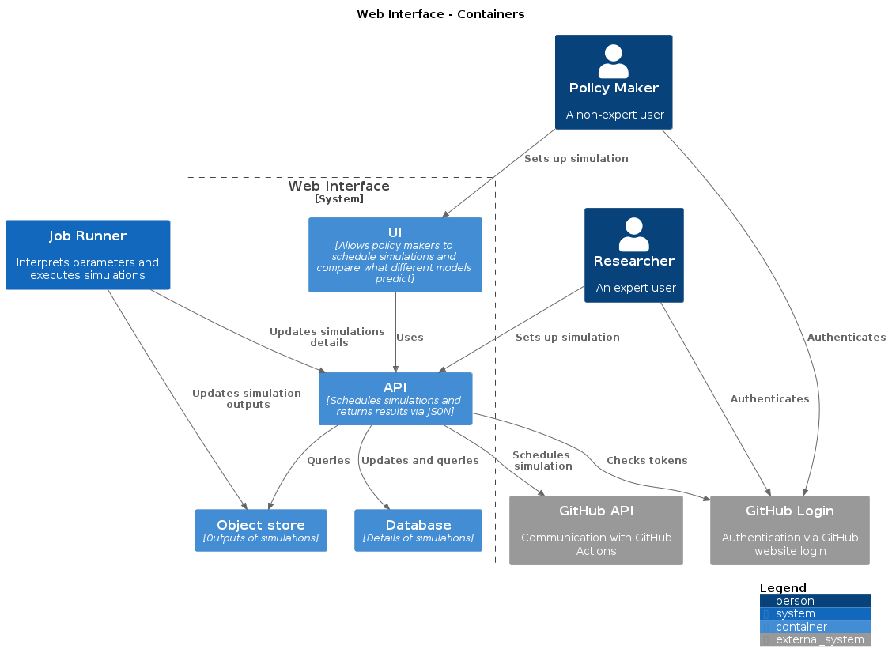
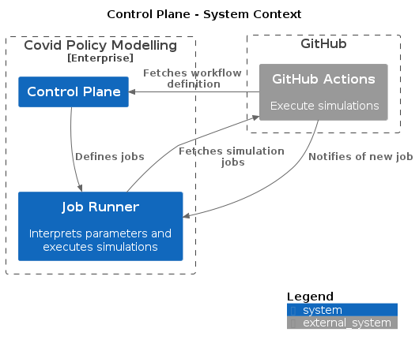
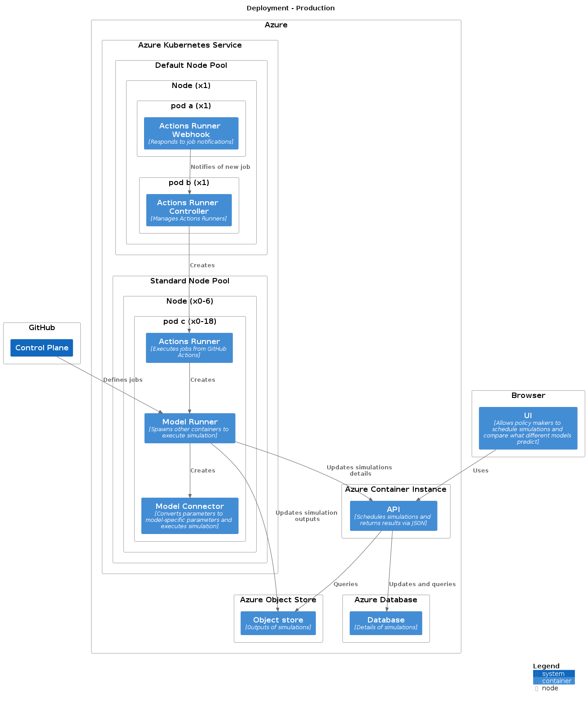
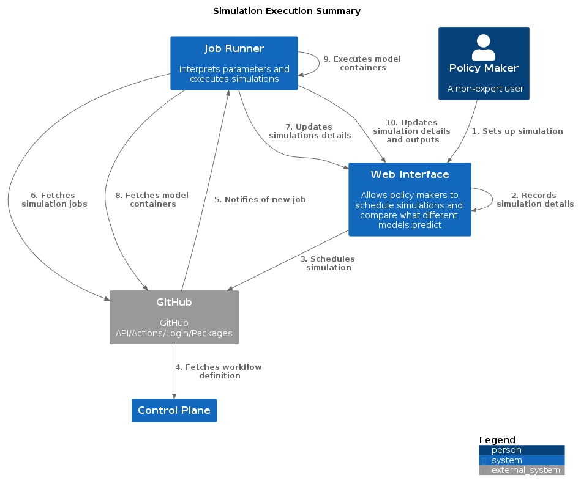

# Architecture

## Systems

The main systems are:

* **Web Interface** - this is the main access point available which allows for simulations to be scheduled and once these are run to display the results.
* **Job Runner** - this spawns Docker containers to run the simulations. Once these are complete it will communicate the results back to the **Web interface**.

## GitHub

GitHub is used for a number of systems in the tool, as shown in this expanded summary:

## Web Interface

The web interface is the main communication point with the users, allowing for simulations to be scheduled and for the display of results.
There is an API available for expert users to schedule simulations without using the UI.

Relevant repositories:

* [web-ui](https://github.com/covid-policy-modelling/web-ui)

## Job Runner

The **Web Interface** will use GitHub Actions to request a simulation, which is executed by a **Model Runner** Docker container.
The **Model Runner** will spawn an additional model-specific **Model Connector** Docker container to run the simulation. Once this are complete it will communicate the results back to the **Web interface**.
The **Model Connector** is used to translate between the input and output schemas of the **Web Interface** and the specific input parameters and output understood by the relevant model.

This is managed using [actions-runner-controller](https://github.com/actions-runner-controller/actions-runner-controller) - the **Actions Runner** and **Actions Runner Controller** containers below are part of this tool.

Relevant repositories:

* [model-runner](https://github.com/covid-policy-modelling/model-runner)
* [model-connector-template](https://github.com/covid-policy-modelling/model-connector-template) - Note that this is a template. Specific models each have their own **Model Connector**.
* [JSON input and output schema used for communication between web interface and model-connectors](https://github.com/covid-policy-modelling/schemas/tree/main/schema)
* [actions-runner](https://github.com/covid-policy-modelling/actions-runner)

## Control Plane

The **Control Plane** is a GitHub repository defining the GitHub Actions workflows that define how the **Model Runner** is executed in response to a simulation request.

Relevant repositories:

* [control-plane-template](https://github.com/covid-policy-modelling/control-plane-template) - Note that this is a template. Each environment needs its own **Control Plane**.

## Deployment

Most systems are designed to be deployed into Azure, with the exception of the **Control Plane** (the UI of the **Web Interface** is a Javascript Single-Page Application, so most of the execution takes place in the user's browser, but the application is served from the same Docker container as the API).
The following diagram shows one configuration, but there will be some differences between each environment.
In particular, the number, size and configuration of node pools for the Azure Kubernetes Service is likely to vary based on the needs of the models used in each environment.

Relevant repositories:

* [infrastructure-template](https://github.com/covid-policy-modelling/infrastructure-template) - Note that this is a template, demonstrating how infrastructure can be managed with Terraform. Each organisation will need to manage their own deployment environment, and may wish to use, adapt or ignore this configuration. We are aiming to make this repository open-source, but cannot do so at present. If you wish to gain access, please contact the [maintainers via GitHub](https://github.com/orgs/covid-policy-modelling/people).

## Communication

When a user requests a simulation through the web-ui, this triggers a sequence of events involving most of the components of the system.
A summary of the communication is shown in the below diagram:

The below diagram shows the same communication in more detail:

