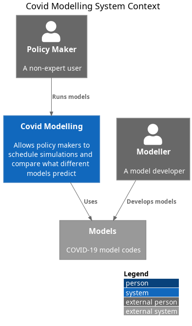

# The Covid Policy Modelling

## Introduction

This project is a collaboration between the University of Edinburgh and Microsoft. It aims to continue work initiated by GitHub during the COVID-19 pandemic to provide a piece of infrastructure that would allow different codes that model the pandemic to be run on the same geographical regions, where models support this, and to compare the model output results with each other as well as to real data. For a  summary of their work see: ""[How predictive are models of Covid-19?](https://github.com/covid-modeling/covid-model-evaluation/blob/main/how-predictive-are-models-of-covid-19.pdf) " from 2020.

The system provides a framework that allows different epidemiological codes to be run at the same time with the same initial conditions,  the same interventions, the same geographical region where these are supported by the models and for the results produced to be compared with each other as well as real empirical data derived for the region being modelled.

The original intent was for *Policy Makers* and/or non-expert users, as shown in the diagram below,  to be the main consumers of the system to try out different scenarios and interventions, e.g. lock-downs, school closures, etc to explore the outcomes of different policy decisions.

 

## System overview

To do this open momore the main components are:

* **Web Interface** (available in the [web-ui](https://github.com/covid-policy-modelling/web-ui) repository) - this is the main access point available which allows for simulations to be scheduled and once these are run to display the results.
* The **Web Interface** will trigger the **Action Runner** (available in the [action-runner](https://github.com/covid-policy-modelling/actions-runner) repository), using GitHub actions, which will deploy a **Model Runner** via a docker engine.
* The **Model Runner** ( see the [model-runner](https://github.com/covid-policy-modelling/model-runner) repository) which will spawn containers (using Microsoft Azure) to run the simulations. Once these are complete it will communicate the results back to the **Web interface**.
* A **Model Connector** (see the [model-connector-template](https://github.com/covid-policy-modelling/model-connector-template) repository) is used to interface between the outputs of the **Web Interface** expressed in JSON and the output from the models that are consumed by the **Web Interface**, both of these must conform to a set of [JSON input and output schema](https://github.com/covid-policy-modelling/model-runner/tree/main/packages/api/schema).

