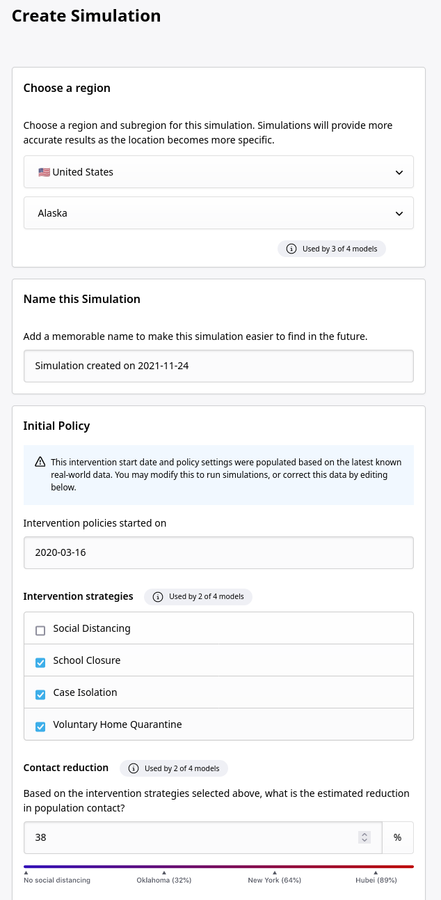

# COVID-UI

COVID-UI allows different codes that model the COVID-19 pandemic to be run on the same geographical regions with the same initial conditions and interventions, and to compare the model output results with each other as well as to real data.
This is achieved through a framework for adapting the inputs and outputs of different models to a common schema, and for running the models on scalable cloud resources.

### Screenshots

{:class="columns"}

## Who is the tool for?

The tool was originally intended for *Policy Makers* and/or non-expert users, as shown in the diagram below, to be the main consumers of the tool.
It allows them to try out different scenarios and interventions, e.g. lock-downs, school closures, etc. to explore the outcomes of different policy decisions.
As a general framework for running models, it is also useful for *Modellers* who want to make use of scalable cloud resources to run simulations, or to compare their models against the work of others.

## About the models

The tool is intended as a general framework in which policy makers can run models of particular interest to themselves, rather than as a specific comparison of a specific set of models.
Models which have been used with the tool include:

* [Covasim](https://github.com/InstituteforDiseaseModeling/covasim) (Institute for Disease Modeling)
* [Covid19-Scenarios](https://covid19-scenarios.org/about) (Neher Lab - Biozentrum Basel)
* [CovidSim](https://github.com/mrc-ide/covid-sim) (Imperial College)
* [Modeling Covid-19](https://modelingcovid.com/about)
* [WSS](https://github.com/gjackland/WSS) (University of Edinburgh / University of Cambridge)

## Where can I learn more?

For policy makers who are interested in learning more about the tool or gaining access to the demonstration server, please contact the [maintainers via GitHub](https://github.com/orgs/covid-policy-modelling/people).
For modellers interested in integrating their model with the tool, please see our documentation for writing a [model-connector](https://github.com/covid-policy-modelling/model-connector-template).
For information on the architecture, or deploying the tool for yourself, see our [architecture documentation](architecture.md).

## Partners

The project was initiated by developers at GitHub, in collaboration with Microsoft and modellers at Basel University, Imperial College, Institute of Disease Modelling and Stanford University.
Many other modeling teams generously provided input and feedback.
Development is being continued as a collaboration between the University of Edinburgh and Microsoft.

## Outputs

For a summary of the initial work done by GitHub, see: "[How predictive are models of Covid-19?](https://github.com/covid-modeling/covid-model-evaluation/blob/main/how-predictive-are-models-of-covid-19.pdf)" from 2020.
